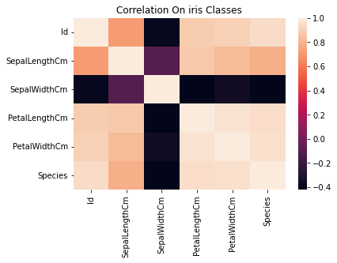

# Iris-Dataset-part-2
This repository contains the implementation of a Support Vector Machine (SVM) algorithm on the classic Iris dataset. The project includes detailed data analysis, visualization, model training, and evaluation. Key steps include data preprocessing, feature exploration, correlation visualization, and performance evaluation using cross-validation.

# Implementation of SVM Algorithm on Iris Dataset

This repository contains the implementation of Support Vector Machine (SVM) algorithm on the Iris dataset. The Iris dataset is a classic dataset in the field of machine learning and statistics, consisting of 150 samples of iris flowers with four features each: sepal length, sepal width, petal length, and petal width, along with their respective species.

## Table of Contents
- [Installation](#installation)
- [Dataset](#dataset)
- [Data Analysis](#data-analysis)
- [Model Training](#model-training)
- [Evaluation](#evaluation)
- [Results](#results)


## Installation

To get started, clone the repository and install the required libraries.

```bash
git clone https://github.com/yourusername/iris-svm.git
cd iris-svm
pip install -r requirements.txt
```

## Dataset

The dataset used in this project is the Iris dataset, which can be found [here](https://www.kaggle.com/uciml/iris). The dataset has been included in this repository as `Iris.csv`.

## Data Analysis

Initial data analysis was conducted to understand the structure and relationships within the dataset. Here are some initial steps taken:

1. **Loading the Dataset**

```python
import pandas as pd

# Load the dataset
dataset = pd.read_csv('Iris.csv')

# Display the first few rows
print(dataset.head())
```

2. **Visualizing Correlations**

A heatmap was created to visualize the correlation between different features in the Iris dataset.

```python
import matplotlib.pyplot as plt
import seaborn as sns

plt.figure(1)
sns.heatmap(dataset.corr(), annot=True)
plt.title('Correlation On Iris Classes')
plt.show()
```



## Model Training

The SVM algorithm was implemented to classify the species of Iris flowers. The dataset was split into training and testing sets, and the model was trained using the training set.

```python
from sklearn.model_selection import train_test_split
from sklearn.svm import SVC

# Split the dataset into features and target variable
X = dataset.iloc[:, :-1]
y = dataset.iloc[:, -1]

# Split the data into training and testing sets
X_train, X_test, y_train, y_test = train_test_split(X, y, test_size=0.25, random_state=0)

# Create the SVM model
classifier = SVC(kernel='linear', random_state=0)
classifier.fit(X_train, y_train)

# Make predictions
y_pred = classifier.predict(X_test)
```

## Evaluation

The performance of the model was evaluated using cross-validation and confusion matrix.

```python
from sklearn.metrics import confusion_matrix
from sklearn.model_selection import cross_val_score

# Evaluate the model using cross-validation
accuracies = cross_val_score(estimator=classifier, X=X_train, y=y_train, cv=10)
print("Accuracy: {:.2f} %".format(accuracies.mean()*100))
print("Standard Deviation: {:.2f} %".format(accuracies.std()*100))
```

## Results

The model achieved an accuracy of 100% with a standard deviation of 0%, indicating perfect classification of the Iris species in the test set.

